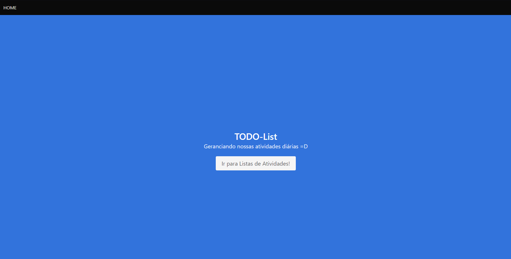
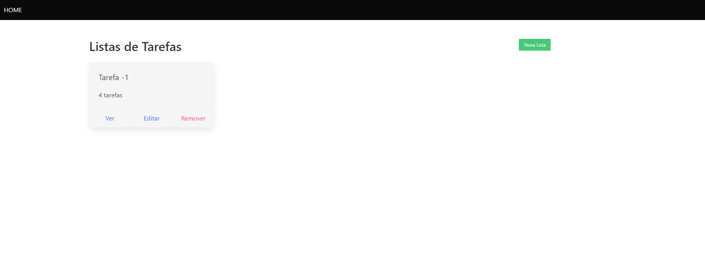
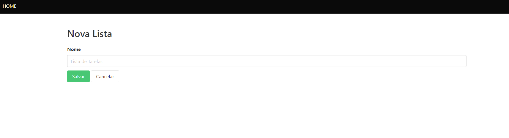
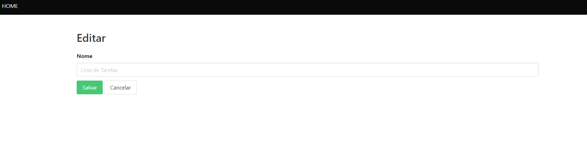
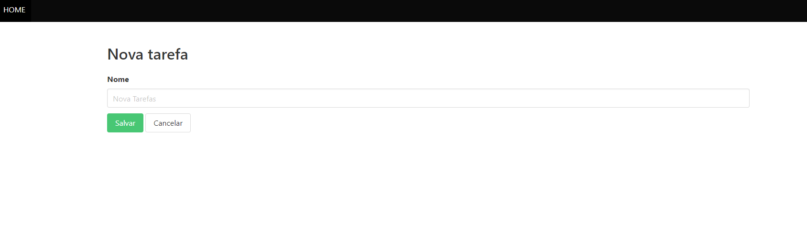
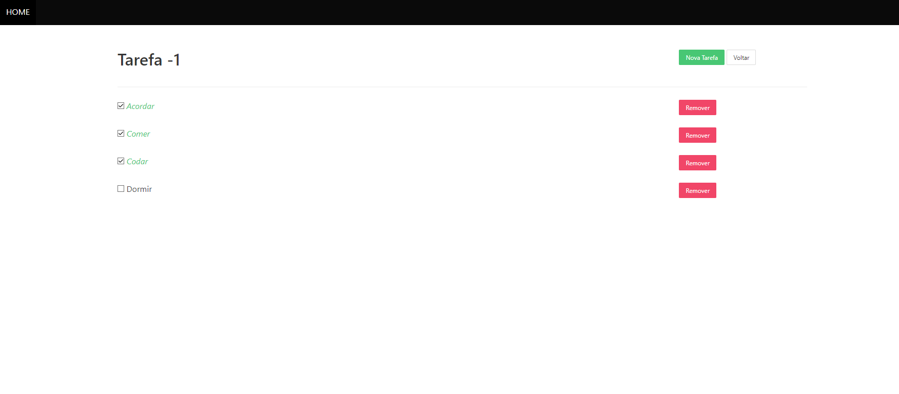

#  TODO-List (Node.js)

A simple to-do list app built with very basic Node.js + Express + MongoDB.

### Resultado:
<h3>Home page</h3>


<h3>To-do list</h3>


<h3>New List</h3>


<h3>Edit List</h3>


<h3>New task</h3>


<h3>Edit task</h3>



### Technologies Used:

- Node.js
- Express
- EJS
- MongoDB
- Mongoose

### How To Run

To run you need to have MongoDB installed and running on your machine. Don't have it? Get it [here](https://docs.mongodb.com/manual/installation/).
Once you have your MongoDB service running you can simply do:

```$ git clone git@/github.com/JuanFila/TO-DO-LIST.git```

```$ cd to-do-list-node```

```$ npm install && npm run dev```


